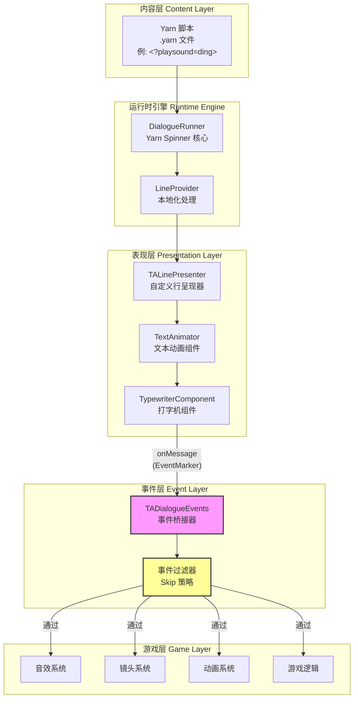
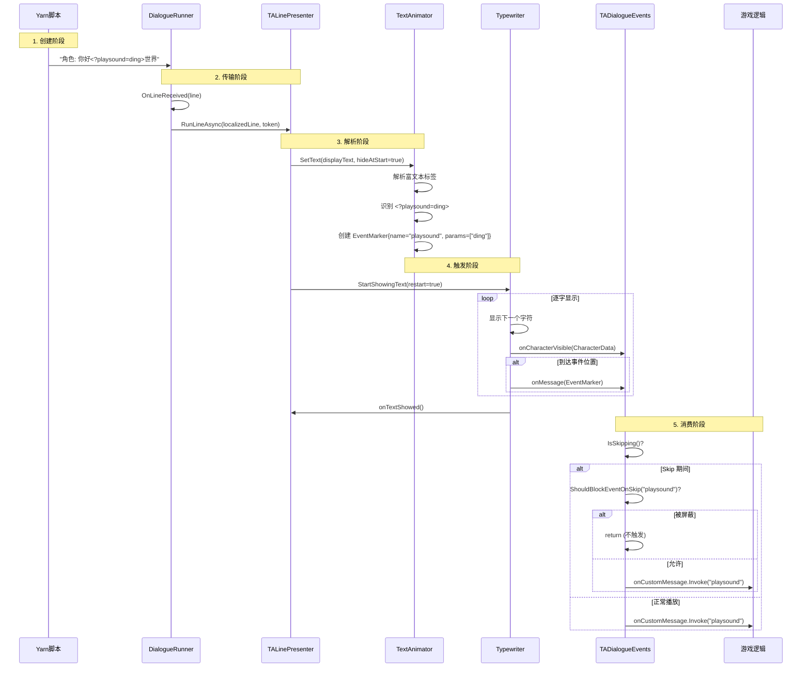
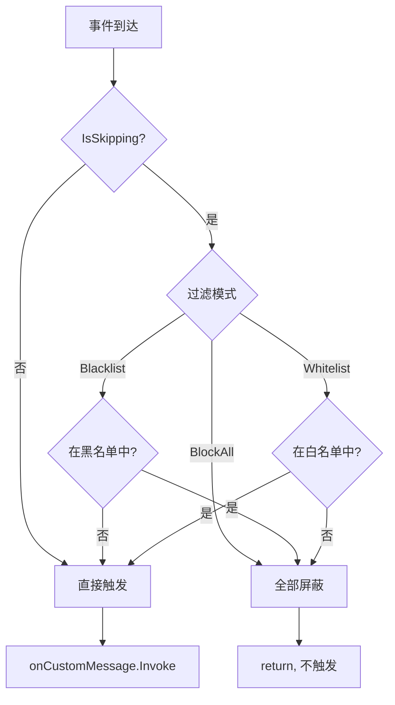
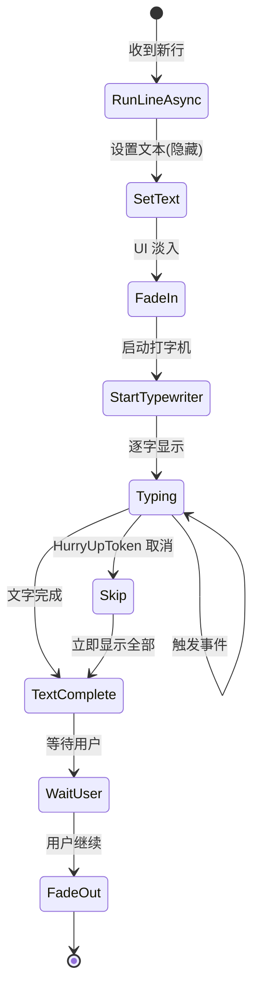
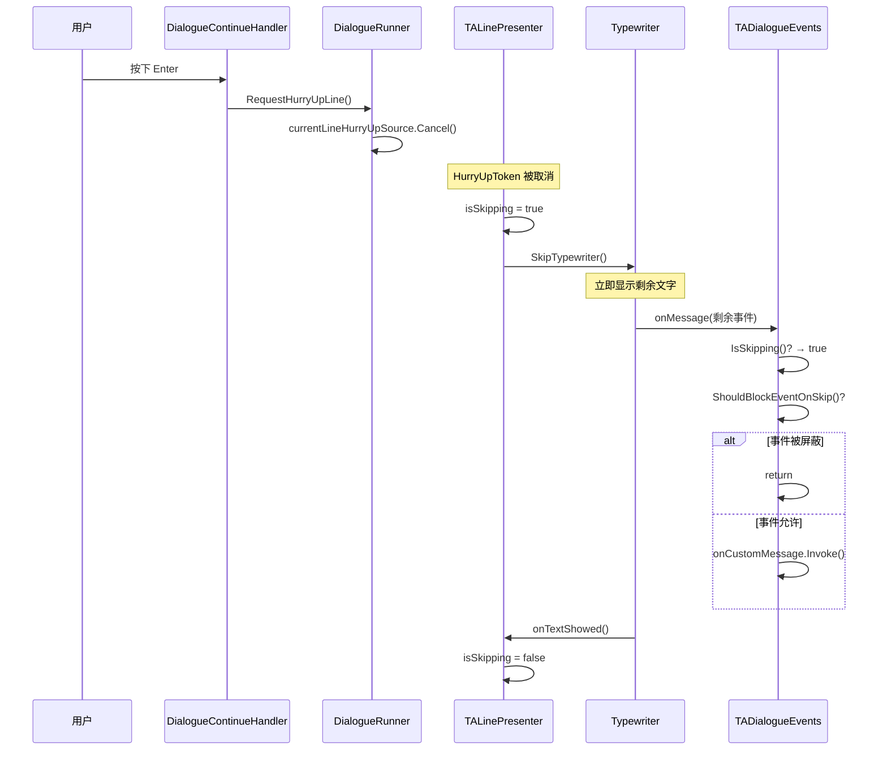
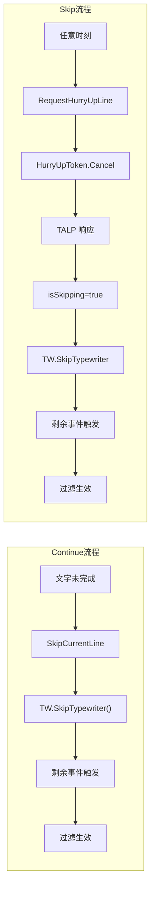
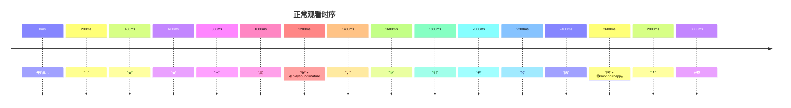
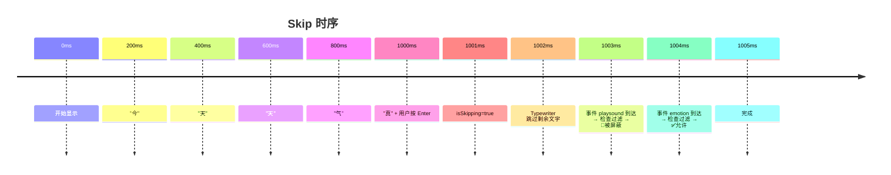
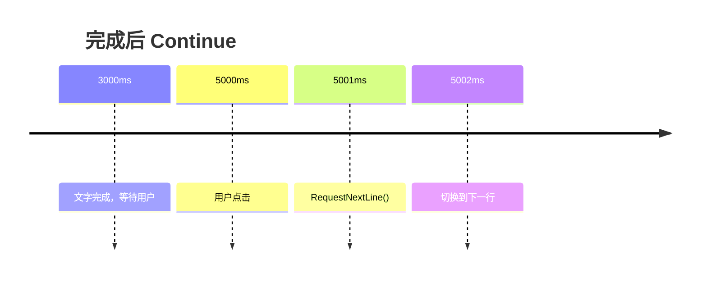

# ITC 事件系统深度剖析

> **文档版本**: 1.0  
> **生成时间**: 2026-01-18  
> **适用范围**: Text Animator + Yarn Spinner 对话系统集成

---

## 📋 目录

1. [摘要](#摘要)
2. [架构总览](#架构总览)
3. [事件的完整生命周期](#事件的完整生命周期)
4. [核心组件详解](#核心组件详解)
5. [用户行为对事件的影响](#用户行为对事件的影响)
6. [示例演示](#示例演示)
7. [关键代码证据](#关键代码证据)

---

## 摘要

ITC 项目中的"事件"系统是连接 **Yarn 脚本文本** 与 **Unity 游戏行为** 的桥梁。事件通过以下流程工作：

1. **创建阶段**：在 `.yarn` 脚本中使用 `<?eventName>` 语法嵌入事件标签
2. **解析阶段**：Text Animator 在解析富文本时识别事件标签并创建 `EventMarker` 对象
3. **触发阶段**：Typewriter 在逐字显示过程中，当到达事件位置时触发 `onMessage` 事件
4. **消费阶段**：`TADialogueEvents` 接收并分发事件，根据当前状态（如 Skip）进行过滤，最终调用 Unity 游戏逻辑

```
重要结论：事件仅在 Typewriter 启用时触发，Skip 状态会根据过滤策略屏蔽特定事件
```

---

## 架构总览

### 系统层次图



### 组件职责表

| 组件 | 文件 | 核心职责 |
|------|------|----------|
| `DialogueRunner` | Yarn.Unity | 对话流程控制、行/选项分发 |
| `TALinePresenter` | `TALinePresenter.cs` | Yarn 行 → Text Animator 适配 |
| `TypewriterComponent` | Text Animator | 打字机效果、事件触发 |
| `TADialogueEvents` | `TADialogueEvents.cs` | 事件桥接、过滤、分发 |
| `DialogueContinueHandler` | `DialogueContinueHandler.cs` | 用户输入 → Skip/Continue |

---

## 事件的完整生命周期

### 时序图



### 生命周期阶段详解

#### 阶段 1：创建（Yarn 脚本编写）

事件在 Yarn 脚本中通过特殊语法嵌入：

```yarn
角色: 这是普通文本<?playsound=ding>后面还有文字
角色: <?camerashake>镜头晃动效果
角色: <?emotion=happy>表情变化（不被 Skip 屏蔽）
```

**语法规范**：
- 格式：`<?eventName>` 或 `<?eventName=param1,param2>`
- 事件名区分大小写
- 事件不占用文本空间（不可见）

#### 阶段 2：传输（Yarn → LinePresenter）

```csharp
// DialogueRunner.cs (Yarn Spinner)
private async YarnTask OnLineReceivedAsync(Line line)
{
    var localisedLine = await LineProvider.GetLocalizedLineAsync(line, ...);
    await RunLocalisedLine(localisedLine);  // 调用所有 Presenter
}

private async YarnTask RunLocalisedLine(LocalizedLine localisedLine)
{
    // 创建取消令牌
    var metaToken = new LineCancellationToken
    {
        NextContentToken = currentLineCancellationSource.Token,
        HurryUpToken = currentLineHurryUpSource.Token,
    };
    
    // 调用每个 Presenter
    foreach (var view in this.dialoguePresenters)
    {
        await view.RunLineAsync(localisedLine, metaToken);
    }
}
```

#### 阶段 3：解析（Text Animator 处理）

```csharp
// TALinePresenter.cs
public override async YarnTask RunLineAsync(LocalizedLine line, LineCancellationToken token)
{
    // 获取纯文本（移除角色名，但保留 TA 标签）
    string displayText = line.TextWithoutCharacterName.Text;
    
    // Text Animator 解析富文本
    // 此时 <?event> 被识别并存储为 EventMarker
    textAnimator.SetText(displayText, true);  // true = 先隐藏
    
    // 启动打字机
    typewriter.StartShowingText(true);
}
```

**Text Animator 内部解析**：
- `<tag>` → 行为/效果标签
- `<?event>` → 事件标签，存储为 `EventMarker`
- `|effect|` → 进场/退场效果（项目自定义符号）

#### 阶段 4：触发（Typewriter 逐字播放）

```csharp
// TypewriterComponent.cs (Text Animator)
// 在初始化时订阅核心事件
_wrapper.OnMessage += (x) => onMessage?.Invoke(x);  // x 是 EventMarker

// Typewriter 内部循环（简化伪代码）
for each character in text:
    wait for typing delay
    show character
    onCharacterVisible.Invoke(character)
    
    if current_position has event:
        EventMarker marker = get_event_at_position()
        onMessage.Invoke(marker)  // 🔥 事件触发点
```

#### 阶段 5：消费（TADialogueEvents 分发）

```csharp
// TADialogueEvents.cs
private void OnMessage(EventMarker marker)
{
    // 1. Skip 过滤
    if (IsSkipping() && ShouldBlockEventOnSkip(marker.name))
    {
        Debug.Log($"Event '{marker.name}' blocked during Skip");
        return;  // 被屏蔽，不继续
    }

    // 2. 转发给所有订阅者
    onCustomMessage?.Invoke(marker.name);

    // 3. 内置处理
    switch (marker.name.ToLower())
    {
        case "playsound":
            // 播放指定音效
            Debug.Log($"Play sound: {marker.parameters[0]}");
            break;
        case "shake":
            // 触发相机震动
            break;
    }
}
```

---

## 核心组件详解

### TADialogueEvents - 事件桥接器

**文件**: `Assets/Scripts/Dialogue/TADialogueEvents.cs`

#### 订阅的事件源

```csharp
private void OnEnable()
{
    // Typewriter 事件
    typewriter.onCharacterVisible.AddListener(OnCharacterVisible);
    typewriter.onTextShowed.AddListener(OnTextShowed);
    typewriter.onMessage.AddListener(OnMessage);  // 🔑 核心事件入口

    // DialogueRunner 事件
    dialogueRunner.onDialogueStart.AddListener(OnDialogueStart);
    dialogueRunner.onDialogueComplete.AddListener(OnDialogueComplete);
    dialogueRunner.onNodeStart.AddListener(OnNodeStart);
    dialogueRunner.onNodeComplete.AddListener(OnNodeComplete);
}
```

#### 事件过滤机制



#### 过滤配置

```csharp
// 黑名单：Skip 时屏蔽这些事件
string[] blockedEventsOnSkip = { "playsound", "camerashake", "shake", "sound" };

// 白名单：Skip 时允许这些事件
string[] allowedEventsOnSkip = { "emotion", "expression", "setvar" };

// 过滤模式
enum SkipEventFilterMode { Blacklist, Whitelist, BlockAll }
```

### TALinePresenter - 行呈现器

**文件**: `Assets/Scripts/Dialogue/TALinePresenter.cs`

#### 核心状态

```csharp
private bool isShowingLine = false;    // 正在显示行
private bool isSkipping = false;       // 正在跳过
private bool isTextFullyShown = false; // 文本已完全显示

// 暴露给外部的只读属性
public bool IsShowingLine => isShowingLine;
public bool IsSkipping => isSkipping;        // 🔑 TADialogueEvents 用此判断是否过滤
public bool IsTextFullyShown => isTextFullyShown;
```

#### 显示流程



### DialogueContinueHandler - 输入处理

**文件**: `Assets/Scripts/Dialogue/DialogueContinueHandler.cs`

#### 输入逻辑

```csharp
public void RequestContinue()
{
    if (linePresenter.IsShowingLine)
    {
        if (linePresenter.IsTextFullyShown)
        {
            // 文字已完成 → 请求下一行
            dialogueRunner.RequestNextLine();
        }
        else
        {
            // 文字未完成 → 跳过打字机
            linePresenter.SkipCurrentLine();
        }
    }
    else
    {
        dialogueRunner.RequestNextLine();
    }
}

public void RequestSkip()
{
    // 直接请求加速（触发 HurryUpToken）
    dialogueRunner.RequestHurryUpLine();
}
```

---

## 用户行为对事件的影响

### 行为对比表

| 用户行为 | 触发方式 | 对事件的影响 | 内部机制 |
|---------|---------|-------------|---------|
| **正常观看** | 无操作 | 所有事件正常触发 | Typewriter 逐字播放 |
| **Continue（文字未完成）** | 点击/空格 | 剩余事件**可能被过滤** | `SkipCurrentLine()` → `isSkipping=true` |
| **Continue（文字已完成）** | 点击/空格 | 无影响（已触发完） | `RequestNextLine()` |
| **Skip（Enter）** | 回车 | 剩余事件**被过滤**（按策略） | `RequestHurryUpLine()` → `HurryUpToken` 取消 |

### Skip 行为详解



### Continue 与 Skip 的区别



**关键区别**：
- **Continue**：先判断文字是否完成，未完成才触发 Skip
- **Skip**：直接触发 HurryUpToken，强制加速

---

## 示例演示

### 假设场景

Yarn 脚本内容：
```yarn
title: Demo
---
小明: 今天天气真好<?playsound=nature>，我们去公园吧<?emotion=happy>！
===
```

### 场景 A：正常观看



**结果**：
- ✅ `playsound=nature` 触发
- ✅ `emotion=happy` 触发

### 场景 B：中途 Skip（在"真"字时）



**结果**（使用 Blacklist 模式）：
- ❌ `playsound=nature` 被屏蔽（在黑名单中）
- ✅ `emotion=happy` 触发（在白名单中）

### 场景 C：文字完成后 Continue



**结果**：
- 所有事件已在正常播放期间触发
- Continue 只影响对话流程，不影响事件

---

## 关键代码证据

### 证据 1：事件触发入口

**文件**: `TADialogueEvents.cs` 第 177-204 行

```csharp
private void OnMessage(EventMarker marker)
{
    // Skip 期间事件过滤
    if (IsSkipping() && ShouldBlockEventOnSkip(marker.name))
    {
        Debug.Log($"[TADialogueEvents] Event '{marker.name}' blocked during Skip");
        return;
    }

    // 转发自定义消息
    onCustomMessage?.Invoke(marker.name);

    // 可以在这里处理特殊消息
    switch (marker.name.ToLower())
    {
        case "playsound":
            if (marker.parameters.Length > 0)
            {
                Debug.Log($"[TADialogueEvents] Play sound: {marker.parameters[0]}");
            }
            break;
        case "shake":
            Debug.Log("[TADialogueEvents] Camera shake triggered");
            break;
    }
}
```

### 证据 2：Skip 状态判断

**文件**: `TADialogueEvents.cs` 第 209-211 行

```csharp
private bool IsSkipping()
{
    return linePresenter != null && linePresenter.IsSkipping;
}
```

**文件**: `TALinePresenter.cs` 第 323 行

```csharp
public bool IsSkipping => isSkipping;
```

### 证据 3：HurryUpToken 处理

**文件**: `TALinePresenter.cs` 第 184-194 行

```csharp
using var hurryUpRegistration = token.HurryUpToken.Register(() =>
{
    if (isShowingLine && typewriter != null)
    {
        isSkipping = true;                    // 🔑 设置 Skip 状态
        typewriter.SkipTypewriter();          // 跳过打字机
        isTextFullyShown = true;
        textShowCompletionSource.TrySetResult(true);
    }
});
```

### 证据 4：Typewriter 事件订阅链

**文件**: `TypewriterComponent.cs` 第 97-104 行

```csharp
_wrapper.OnTextShowed += () => onTextShowed?.Invoke();
_wrapper.OnTextDisappeared += () => onTextDisappeared?.Invoke();
_wrapper.OnTypewriterStart += () => onTypewriterStart?.Invoke();
_wrapper.OnMessage += (x) => onMessage?.Invoke(x);  // 🔑 事件转发
_wrapper.OnCharacterWaitStarted += (character, mode) => onCharacterWaitStarted?.Invoke(character, mode);
_wrapper.OnCharacterWaitFinished += (character, mode) => onCharacterWaitFinished?.Invoke(character, mode);
_wrapper.OnCharacterVisible += (x) => onCharacterVisible?.Invoke(x);
```

### 证据 5：过滤策略实现

**文件**: `TADialogueEvents.cs` 第 217-237 行

```csharp
private bool ShouldBlockEventOnSkip(string eventName)
{
    if (string.IsNullOrEmpty(eventName)) return false;

    var lowerName = eventName.ToLower();

    switch (skipEventFilterMode)
    {
        case SkipEventFilterMode.BlockAll:
            return true;  // 全部屏蔽

        case SkipEventFilterMode.Whitelist:
            // 只有白名单中的事件才允许触发
            return !_allowedEventsSet.Contains(lowerName);

        case SkipEventFilterMode.Blacklist:
        default:
            // 只屏蔽黑名单中的事件
            return _blockedEventsSet.Contains(lowerName);
    }
}
```

---

## EventMarker 数据结构

### 结构定义

`EventMarker` 是 Text Animator 用于传递事件信息的核心数据结构：

```csharp
// Febucci.TextAnimatorCore.Typing.EventMarker (来自 Text Animator 库)
public struct EventMarker
{
    /// <summary>事件名称（不含 <? 和 >）</summary>
    public string name;
    
    /// <summary>事件参数数组</summary>
    public string[] parameters;
    
    /// <summary>事件在文本中的字符位置</summary>
    public int charIndex;
}
```

### 解析规则

| Yarn 标签 | `name` | `parameters` |
|-----------|--------|--------------|
| `<?playsound>` | `"playsound"` | `[]` (空数组) |
| `<?playsound=ding>` | `"playsound"` | `["ding"]` |
| `<?playsound=ding,laugh>` | `"playsound"` | `["ding", "laugh"]` |
| `<?setvar=money,100>` | `"setvar"` | `["money", "100"]` |

### 使用示例

```csharp
void OnMessage(EventMarker marker)
{
    switch (marker.name.ToLower())
    {
        case "playsound":
            if (marker.parameters.Length > 0)
            {
                string soundName = marker.parameters[0];
                AudioManager.Play(soundName);
            }
            break;
            
        case "setvar":
            if (marker.parameters.Length >= 2)
            {
                string varName = marker.parameters[0];
                string value = marker.parameters[1];
                VariableStorage.SetValue("$" + varName, value);
            }
            break;
            
        case "emotion":
            if (marker.parameters.Length > 0)
            {
                CharacterManager.SetEmotion(marker.parameters[0]);
            }
            break;
    }
}
```

---

## 总结

### 核心要点

1. **事件只在 Typewriter 启用时触发** - 如果禁用打字机效果，事件不会触发
2. **Skip 会影响事件触发** - 根据配置的过滤策略决定哪些事件被屏蔽
3. **事件大小写敏感** - `<?playSouND>` 和 `<?playsound>` 是不同的事件
4. **事件参数通过逗号分隔** - `<?event=a,b,c>` 产生 `params=["a","b","c"]`

### 最佳实践

1. **重要逻辑事件放入白名单** - 如表情、变量设置
2. **音效/视觉效果放入黑名单** - 避免 Skip 时叠加爆炸
3. **在脚本开头放置关键事件** - 减少被 Skip 跳过的风险
4. **使用小写事件名** - 避免大小写问题

### 扩展建议

如需添加新事件类型：
1. 在 `TADialogueEvents.OnMessage()` 的 switch 中添加处理分支
2. 根据事件特性决定是否加入黑名单/白名单
3. 通过 `onCustomMessage` Unity Event 连接具体游戏逻辑
