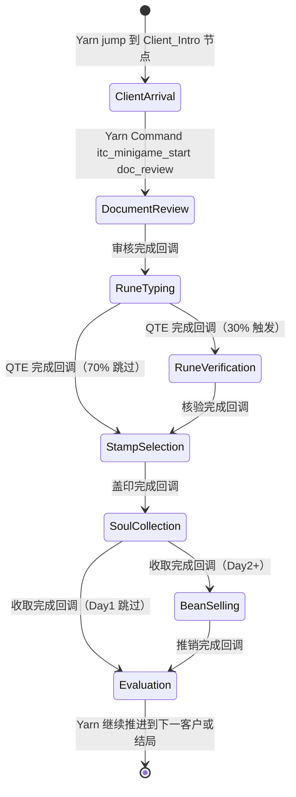
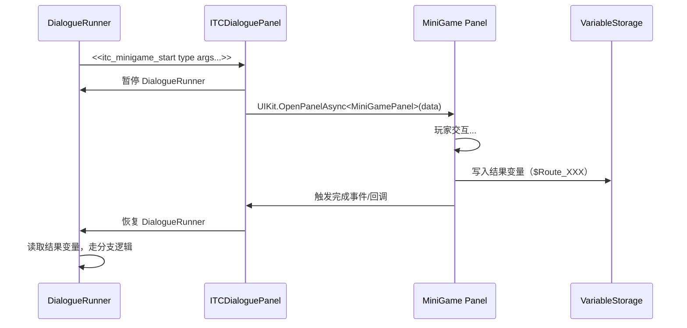
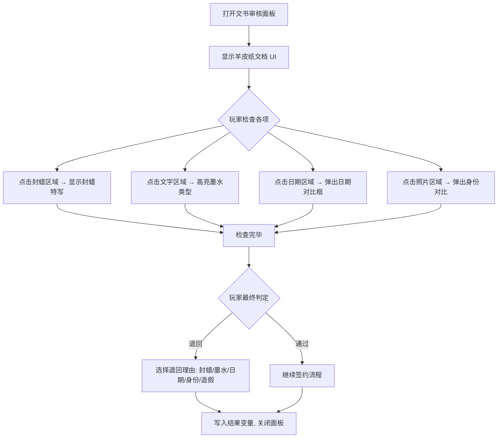
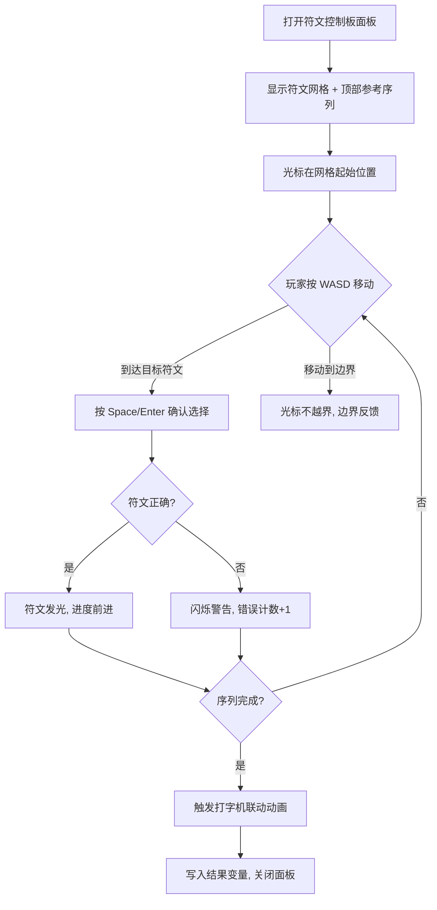
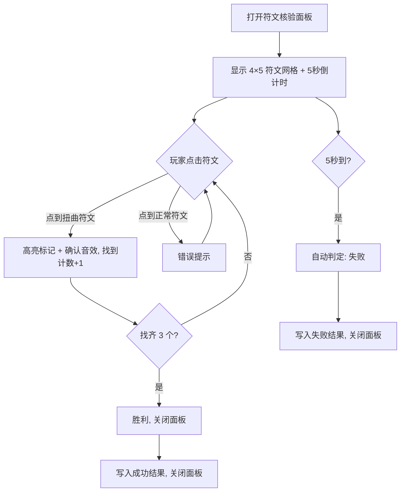
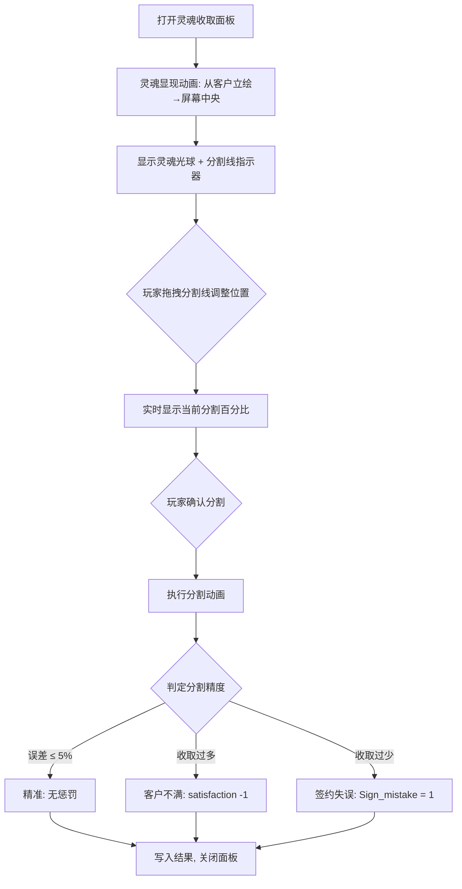
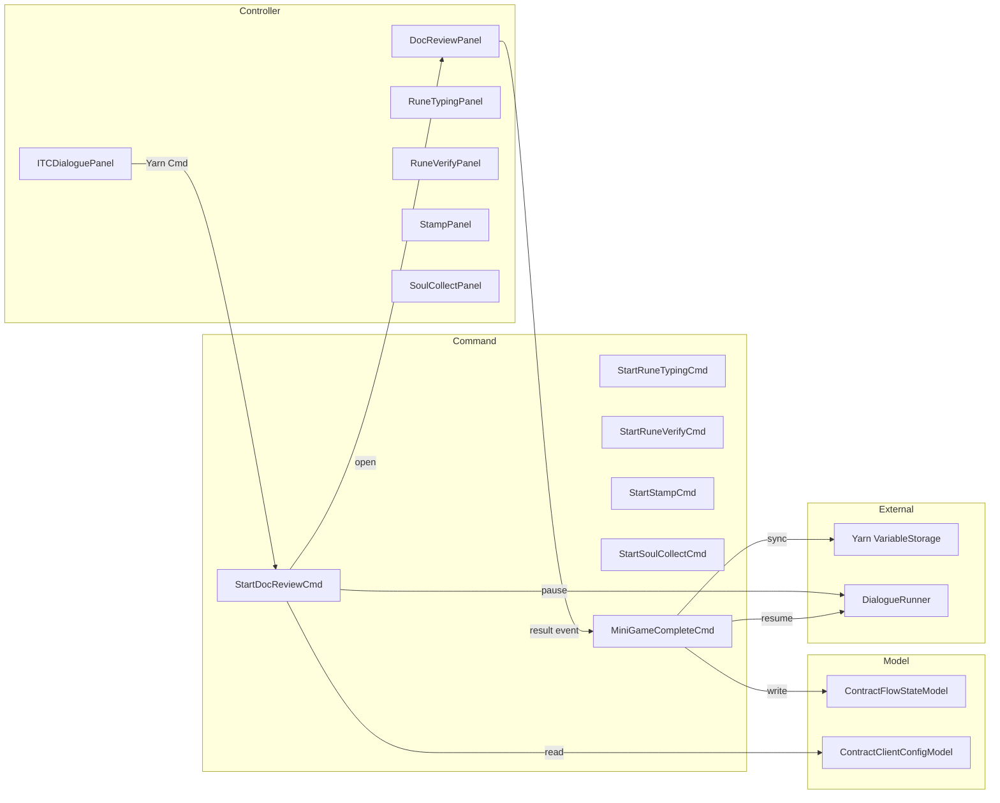

# ITC 签约流程小游戏系统设计

> **文档性质**：纯设计文档，不写具体实现代码。颗粒度落到"具体代码之上一层"，为每个小游戏模块提供可被专人负责实现的明确指导。

---

## 1. 全局上下文：现有架构概览

### 1.1 当前技术栈

| 层 | 实现 |
|---|---|
| 架构 | QFramework CQRS（[MainMenuApp](file:///c:/Users/jinji/Documents/GitHub/ITC-Unity6/ITC-Unity6/Assets/Scripts/MainMenu/MainMenuApp.cs#3-10) 为根 Architecture） |
| 对话驱动 | Yarn Spinner + `DialogueRunner` → `TALinePresenter`（Text Animator 打字机） |
| 面板管理 | UIKit（`UIKit.OpenPanelAsync<T>`），面板 prefab 通过 ResKit bundle 加载 |
| 视觉命令 | [ITCDialoguePanel](file:///c:/Users/jinji/Documents/GitHub/ITC-Unity6/ITC-Unity6/Assets/Scripts/Dialogue/ITCDialoguePanel.cs#18-518) 注册 Yarn Commands（`itc_bg`, `itc_npc_main` 等） |
| 状态 | [MainMenuStateModel](file:///c:/Users/jinji/Documents/GitHub/ITC-Unity6/ITC-Unity6/Assets/Scripts/MainMenu/MainMenuStateModel.cs#3-15)（BindableProperty），Yarn 变量（`$Sign_mistake`, `$satisfaction` 等） |
| 资源 | ResKit 分包：`menu_core` / `dialogue_ui` / `dialogue_bg` / `dialogue_portrait` / `dialogue_script` |
| 目标平台 | WebGL（单线程、异步加载） |

### 1.2 当前 Yarn 签约流程结构

```
ITC_Start → ... → ITC_Act3_Entry（签约主线入口）
  → ITC_Day1_ClientSequence → ITC_Client1_Emmett_Intro
    → ITC_Client1_FileCheck      ← 文书审核（选择题）
    → ITC_Client1_TypewriterInput ← 打字机 QTE（选择题占位）
    → C2_D155                     ← QTE 结果判定
    → ITC_Client1_StampInput      ← 印章选择（选择题）
    → C2_D146                     ← 印章结果判定
    → ITC_Client1_SoulInput       ← 灵魂收取（选择题占位）
    → C3_D176                     ← 灵魂判定
    → ITC_Client1_PostContract    ← 签后反馈
    → C3_D252                     ← Henet 评价 → 跳到下一客户
```

> **关键发现**：当前 Yarn 脚本中，所有小游戏环节均使用 Yarn `->` 选项（选择题）做**占位**。实际策划设计中涉及 6 种不同玩法的小游戏，需要用专门的 UI 面板/组件替代这些占位选项。

---

## 2. 签约流程小游戏边界划分

策划案中，一次完整的客户签约流程包含以下 **7 个环节**（按时间顺序）：


### 2.1 各环节边界定义

| # | 小游戏名 | 类型 | 触发方式 | 是否必选 | 策划核心机制 |
|---|---|---|---|---|---|
| ① | 文书审核 | UI 交互 + 判断 | Yarn Command 触发 | 每位客户必须 | 查看羊皮纸→检查封蜡/墨水/日期/身份→判定是否退回 |
| ② | 符文控制板（打字机） | WASD 方向键 QTE | Yarn Command 触发 | 每位客户必须 | 4×4/5×5 网格，按序输入符文序列，错误计数影响结果 |
| ③ | 符文核验（找茬） | 限时点击小游戏 | 30% 概率触发 | 随机 | 4×5 网格，5 秒内找出 3 个扭曲符文 |
| ④ | 印章选择与盖印 | 选择 + 时机判定 | Yarn Command 触发 | 每位客户必须 | 四选一印章类型 + 蓄力时机点击盖印 |
| ⑤ | 灵魂收取（分割） | 操作交互 | Yarn Command 触发 | 每位客户必须 | 分灵刀分割灵魂光球，按份额比例判定 |
| ⑥ | 豆罐头推销 | 对话分支 | Day 2 起，签约完成后 | 有条件 | 通过对话系统实现推销逻辑 |
| ⑦ | 满意度结算 + 离场 | 自动系统 | 签约完成后自动 | 每位客户必须 | 根据累计操作结果计算满意度、小费、评价 |

### 2.2 签约流程生命周期



---

## 3. 核心架构设计：Yarn ⟷ 小游戏桥接机制

### 3.1 设计原则

1. **Yarn 是主控制流**：所有小游戏的触发和结果回写都通过 Yarn Commands + Variables 完成
2. **小游戏是模态面板**：每个小游戏以 UIKit Panel 或 VisualElement 覆盖在对话系统上方
3. **对话暂停-恢复**：小游戏打开时暂停 Yarn 推进，小游戏完成/关闭后恢复
4. **结果回写 Yarn**：小游戏通过 Yarn 的 `VariableStorage` 直接写入结果变量

### 3.2 通用桥接协议



### 3.3 新增 Yarn Commands 设计

在 [ITCDialoguePanel](file:///c:/Users/jinji/Documents/GitHub/ITC-Unity6/ITC-Unity6/Assets/Scripts/Dialogue/ITCDialoguePanel.cs#18-518) 中新增注册以下自定义命令：

| Yarn Command | 参数 | 作用 |
|---|---|---|
| `itc_doc_review` | `client_id` | 打开文书审核面板 |
| `itc_rune_typing` | `client_id`, `grid_size`（4/5） | 打开符文控制板 QTE |
| `itc_rune_verify` | `client_id` | 打开符文核验找茬（内部判断是否触发） |
| `itc_stamp_select` | `client_id` | 打开印章选择与盖印面板 |
| `itc_soul_collect` | `client_id`, `target_percent` | 打开灵魂收取面板 |
| `itc_bean_sell` | `client_id` | 打开豆罐头推销对话（可复用对话系统） |

这些命令在执行时：
1. 暂停 `DialogueRunner`（`dialogueRunner.Stop()` 或使用 `Coroutine` 等待）
2. 打开对应的小游戏 Panel
3. Panel 关闭时写入 Yarn 变量并恢复对话

### 3.4 Yarn 脚本改造方案

将当前选项占位替换为 Command 调用。以 Client 1 为例：

```yarn
title: ITC_Client1_FileCheck
---
<<itc_doc_review 1>>
// 小游戏结束后 $Route_DocReviewResult 已被写入
<<if $Route_DocReviewResult == "rejected_wrong">>
    <<set $Sign_mistake = 1>>
    <<set $satisfaction = $satisfaction - 1>>
    Narrator: 判定错误。该文件本应继续流程。
<<endif>>
<<jump ITC_Client1_TypewriterInput>>
===

title: ITC_Client1_TypewriterInput
---
<<itc_rune_typing 1 4>>
// QTE 结束后 $Route_QTEErrorCount 已被写入
<<itc_rune_verify 1>>
// 核验结束后 $Route_RuneVerifyResult 已被写入
<<jump C2_D155>>
===
```

---

## 4. 各小游戏详细设计

---

### 4.1 ① 文书审核（DocumentReviewPanel）

#### 4.1.1 功能描述

玩家查看一份羊皮纸文档，需检查 4 个要素并做出"退回/通过"判定。

#### 4.1.2 交互流程



#### 4.1.3 数据模型（ScriptableObject 或 JSON）

```
ClientDocumentData:
  clientId: int
  clientName: string
  portraitKey: string              // 对应 VisualCatalog key
  documentSprite: Sprite           // 羊皮纸背景
  sealStatus: Intact | Broken      // 封蜡状态
  inkType: XiaJin | Normal | Forged // 墨水类型
  appointmentDate: string          // 预约日期
  currentGameDate: string          // 当天日期
  photoMatchesClient: bool         // 照片是否匹配
  contractContent: string          // 契约文本
  soulPercentage: string           // 灵魂份额描述
  correctAction: Pass | Reject     // 正确操作
  correctRejectReason: string      // 若应退回，正确理由
```

#### 4.1.4 UI 结构

- **底层**：羊皮纸大图（可缩放/拖拽查看）
- **可交互热点**：封蜡、文字/墨水、日期栏、照片位置
- **判定区**：底部两个按钮——"退回文件" / "继续流程"
- **退回弹窗**：选择退回理由（封蜡破损/墨水造假/日期不符/身份不符/纸张伪造）
- **右侧对比区**：当前游戏日期显示、客户立绘（供身份核对）

#### 4.1.5 结果写入

| Yarn 变量 | 说明 |
|---|---|
| `$Route_DocReviewResult` | `"passed"` / `"rejected_correct"` / `"rejected_wrong"` |
| `$Sign_mistake` | 若判定错误则 +1 |
| `$satisfaction` | 若判定错误则 -1 |

#### 4.1.6 素材需求

| 素材 | 格式 | 数量 | 说明 |
|---|---|---|---|
| 羊皮纸底图 | Sprite | 每客户 1 张 | 含手写体契约内容 |
| 封蜡完整/破损 | Sprite × 2 | 通用 + 特殊 | 清晰蜡印 vs 裂纹蜡印 |
| 霞金墨水 vs 普通墨水 | 视觉差异 | 内置于羊皮纸 | 文字颜色/光泽差异 |
| 客户照片/素描 | Sprite | 每客户 1 张 | 嵌在羊皮纸上 |
| 日期对比 UI | 预制件 | 1 | 通用组件 |
| 音效 | Audio | 3 | 翻页、退回、通过 |

---

### 4.2 ② 符文控制板 / 打字机 QTE（RuneTypingPanel）

#### 4.2.1 功能描述

玩家在 4×4 或 5×5 符文网格上，用 WASD 移动光标，按序选择正确符文序列。错误次数影响签约结果。

#### 4.2.2 交互流程



#### 4.2.3 数据模型

```
RuneTypingConfig:
  gridWidth: int (4 or 5)
  gridHeight: int (4 or 5)
  runePool: List<RuneData>         // 可选符文库
  targetSequence: List<int>        // 正确符文序列（索引）
  runeGridLayout: int[][]          // 网格中符文的排列

RuneData:
  runeId: int
  normalSprite: Sprite
  glowSprite: Sprite
  errorSprite: Sprite
```

#### 4.2.4 UI 结构

- **顶部**：参考符文序列（高亮当前应选符文）
- **中央**：N×N 符文网格（每格一个符文图标）
- **光标**：铜制选择框，平滑移动动画
- **底部**：错误计数指示器
- **右侧（可选）**：打字机预览区

#### 4.2.5 错误惩罚规则

| 错误次数 | 效果 |
|---|---|
| 0 | 完美，无惩罚 |
| 1 | 轻微失误，无惩罚 |
| 2 | 符文混乱视效，`$satisfaction -= 1` |
| ≥3 | 视为签约失误，`$Sign_mistake = 1` |

#### 4.2.6 打字机联动动画（纯表现）

序列完成后触发的联动动画流程：
1. 打字机启动声 → 机械动画
2. 符文能量线从网格流向打字机
3. 纸张上文字逐渐显现
4. 完成后自动关闭面板

#### 4.2.7 结果写入

| Yarn 变量 | 说明 |
|---|---|
| `$Route_QTEErrorCount` | 总错误次数 |

#### 4.2.8 素材需求

| 素材 | 格式 | 数量 | 说明 |
|---|---|---|---|
| 符文图标 | Sprite | 20-30 个 | 不同形状的魔法符文 |
| 符文发光/错误态 | Sprite 变体 | 每符文 2 个 | 正确高亮 + 错误闪烁 |
| 铜制光标 | Sprite | 1 | 选择框 |
| 网格背景 | Sprite | 1 | 铜制控制板底图 |
| 打字机动画 | Animation/Spine | 1 套 | 联动表现 |
| 能量流特效 | VFX/粒子 | 1 | 符文→打字机 |
| 音效 | Audio | 4 | 移动、选中、错误、完成 |

---

### 4.3 ③ 符文核验 / 找茬（RuneVerifyPanel）

#### 4.3.1 功能描述

30% 概率触发。在 4×5 = 20 个符文组成的网格中，有 3 个是扭曲/错误版本，玩家需在 5 秒内全部找出。

#### 4.3.2 触发机制

```csharp
// 在 itc_rune_verify Command 内部
if (Random.value > 0.3f)
{
    // 不触发，直接写入 $Route_RuneVerifyResult = "skipped"
    // 恢复 Yarn
    return;
}
// 触发找茬面板
```

#### 4.3.3 交互流程



#### 4.3.4 数据模型

```
RuneVerifyConfig:
  gridWidth: 4
  gridHeight: 5
  timeLimitSeconds: 5.0f
  distortedCount: 3
  runePool: List<RuneData>         // 正常符文库
  distortedVariants: Dict<int, Sprite> // 每个符文的扭曲版

生成逻辑：
1. 随机从 runePool 选 20 个填充网格
2. 随机选 3 个位置替换为 distortedVariants
```

#### 4.3.5 UI 结构

- **顶部**：5 秒倒计时进度条 + 文字提示"找出 3 个扭曲符文！"
- **中央**：4×5 网格，每格一个符文按钮
- **底部**：已找到计数 (X/3)

#### 4.3.6 失败惩罚

失败时设置一个状态标记（`$Route_RuneVerifyResult = "failed"`），影响后续盖印环节：
- 盖印阶段界面会出现屏幕晃动效果，增加玩家操作难度

#### 4.3.7 结果写入

| Yarn 变量 | 说明 |
|---|---|
| `$Route_RuneVerifyResult` | `"skipped"` / `"success"` / `"failed"` |

#### 4.3.8 素材需求

| 素材 | 格式 | 数量 | 说明 |
|---|---|---|---|
| 扭曲版符文 | Sprite | 20-30 个 | 每个正常符文对应一个扭曲版 |
| 倒计时 UI | 预制件 | 1 | 进度条 + 数字 |
| 音效 | Audio | 3 | 正确发现、错误点击、倒计时紧张 |

---

### 4.4 ④ 印章选择与盖印（StampPanel）

#### 4.4.1 功能描述

分两步：先四选一选择正确的印章类型，再通过蓄力时机点击完成盖印。

#### 4.4.2 交互流程

```mermaid
flowchart TD
  A[打开印章面板] --> B[显示 4 个印章: 金钱/名利/特技/事件]
  B --> C{玩家点击选择印章}
  C --> D[选定印章, 进入盖印仪式]
  D --> E[印章符文开始蓄力动画: 暗→赤红]
  E --> F{玩家点击时机}
  F --> |最亮时| G[完美盖印: satisfaction +1]
  F --> |偏早/偏晚| H[普通盖印: 无加分]
  F --> |严重偏差| I[失败盖印: satisfaction -1]
  G --> J[显示盖印视觉效果]
  H --> J
  I --> J
  J --> K[写入结果变量, 关闭面板]

  note right of E: 若符文核验失败,屏幕晃动干扰
```

#### 4.4.3 数据模型

```
StampConfig:
  clientId: int
  correctStampType: StampType      // 金钱/名利/特技/事件
  chargeDuration: float            // 蓄力周期（秒）
  perfectWindowStart: float        // 完美窗口起始（0-1）
  perfectWindowEnd: float          // 完美窗口结束（0-1）
  screenShake: bool                // 是否受符文核验失败影响

StampType enum: Money, Fame, Skill, Event
```

#### 4.4.4 印章类型选择规则

| 印章 | 描述符 | 适用场景 |
|---|---|---|
| 🏆 金钱 | 财富相关契约 | 申请金钱/财务类愿望 |
| 🌟 名利 | 声望相关契约 | 申请名望/地位类愿望 |
| ⚡ 特技 | 技能相关契约 | 申请技能/能力类愿望 |
| 📅 事件 | 事件相关契约 | 申请事件发生类愿望 |

> 例：Emmett 应选"事件"（永远喝不完的酒 = 事件类），Thomas 应选"特技"（治愈肺病 = 技能类）

#### 4.4.5 盖印时机判定

蓄力条从 0→1 循环，符文亮度对应当前值：

| 区间 | 判定 | 效果 |
|---|---|---|
| `[perfectStart, perfectEnd]` | 完美 | `$satisfaction += 1` |
| `[perfectStart-0.15, perfectEnd+0.15]` | 普通 | 无效果 |
| 其余 | 失败 | `$satisfaction -= 1` |

#### 4.4.6 UI 结构

- **印章架区域**：4 个印章按钮，各有独特图案和提示
- **盖印区域**：羊皮纸预览 + 印章位置指示
- **蓄力条**：环形或线性蓄力进度条
- **印章符文光效**：暗淡→赤红色渐变

#### 4.4.7 视觉效果

盖印成功后触发：血红色光晕从印章扩散 → 印章图案留在羊皮纸上 → 能量波动粒子效果

#### 4.4.8 结果写入

| Yarn 变量 | 说明 |
|---|---|
| `$Route_StampType` | 选择的印章类型字符串 |
| `$Route_StampTimingResult` | `"perfect"` / `"normal"` / `"failed"` |

#### 4.4.9 素材需求

| 素材 | 格式 | 数量 | 说明 |
|---|---|---|---|
| 四种印章图标 | Sprite | 4 | 金钱/名利/特技/事件 |
| 印章蓄力动画 | AnimationClip / Shader | 1 | 暗→亮循环 |
| 盖印成功特效 | VFX/粒子 | 1 | 血红光晕 + 能量波 |
| 印在羊皮纸上的戳记 | Sprite | 4 | 各类型印记 |
| 屏幕晃动 | DOTween / Shader | 1 | 核验失败时干扰 |
| 音效 | Audio | 4 | 选择、蓄力、盖印、失败 |

---

### 4.5 ⑤ 灵魂收取 / 分割（SoulCollectPanel）

#### 4.5.1 功能描述

契约生效后，客户灵魂以光球形式呈现。玩家操控分灵刀分割灵魂，按契约规定的份额收取。

#### 4.5.2 交互流程



#### 4.5.3 数据模型

```
SoulCollectConfig:
  clientId: int
  targetPercent: int               // 契约规定的灵魂份额（如 50）
  toleranceRange: int              // 允许误差（如 5 = ±5%）
  soulColor: Color                 // 角色特征色彩
  clientPortraitKey: string        // 立绘 key
```

#### 4.5.4 UI 结构

- **中央**：灵魂光球（圆形/球形，带角色特征色彩光晕）
- **分割指示器**：可拖拽的分割线/刀刃
- **百分比显示**：实时显示当前分割比 "XX%"
- **确认按钮**：确认分割
- **左右标注**："公司收取" vs "归属客户"
- **背景**：收取部分显示为血红色，剩余部分保持原色

#### 4.5.5 分割判定规则

| 情况 | 条件 | 效果 |
|---|---|---|
| 精准 | `|actual - target| ≤ tolerance` | 无惩罚 |
| 收取过多 | `actual > target + tolerance` | `$satisfaction -= 1` |
| 收取过少 | `actual < target - tolerance` | `$Sign_mistake = 1`，触发 Henet 警告 |

#### 4.5.6 结果写入

| Yarn 变量 | 说明 |
|---|---|
| `$Route_SoulCollectPercent` | 实际收取百分比 |
| `$Route_SoulMin` | 本客户最低要求 |
| `$Route_SoulMax` | 本客户最高允许 |

#### 4.5.7 素材需求

| 素材 | 格式 | 数量 | 说明 |
|---|---|---|---|
| 灵魂光球 | Shader / Sprite + 粒子 | 1 套 | 可着色，发光效果 |
| 分灵刀 | Sprite | 1 | 分割工具视觉 |
| 灵魂转移动画 | 粒子/DOTween | 1 | 从立绘→中央 |
| 分割动画 | 粒子/Shader | 1 | 一分为二效果 |
| 音效 | Audio | 3 | 灵魂显现、分割、收取 |

---

### 4.6 ⑥ 豆罐头推销（BeanSellDialog）

#### 4.6.1 功能描述

从 Day 2 开始，契约完成后触发。通过对话系统的分支选择实现推销逻辑。

#### 4.6.2 设计方案

**不需要独立 Panel**，复用现有的 Yarn 对话系统：
- 在 Yarn 脚本中添加推销对话节点
- 使用 Yarn Options（`->`）呈现推销话术选项
- 根据客户预设的购买意愿判定结果

#### 4.6.3 数据模型（嵌入 Yarn 变量 + 客户数据）

```
BeanSellConfig（写在客户数据中）:
  buyWillingness: float (0-1)       // 购买意愿
  preferredPitch: string            // 偏好的推销方式

Yarn 变量:
  $Route_BeanSoldCount              // 当天累计卖出数
  $Route_BeanSellResult             // 本次推销结果
```

#### 4.6.4 交互流程

1. 契约完成 → Yarn 跳到推销节点
2. 玩家选择推销话术（2-3 个选项）
3. 根据客户意愿和话术匹配度判定
4. 成功：`$Route_BeanSoldCount += 1`
5. 失败：`$satisfaction -= 1`

#### 4.6.5 素材需求

| 素材 | 格式 | 数量 | 说明 |
|---|---|---|---|
| 豆罐头道具图 | Sprite | 1 | 展示用 |
| 推销相关对话文本 | Yarn 节点 | 每客户 1 | 写在 Yarn 内 |

---

### 4.7 ⑦ 客户满意度结算 + 离场（自动系统，无独立 Panel）

#### 4.7.1 功能描述

签约流程结束后自动计算，不需要独立面板。

#### 4.7.2 结算逻辑

```
最终满意度 = 初始值(3)
  + 各环节增减
  + 盖印时机加成

if 满意度 >= 3:
  客户给出小费
  触发正面评价对话
else:
  触发负面评价对话

小费金额依据客户社会地位:
  穷人: 0-1 元
  工人: 1-3 元
  小资产阶级: 3-5 元
```

#### 4.7.3 结果变量

| Yarn 变量 | 说明 |
|---|---|
| `$satisfaction` | 最终满意度 |
| `$money` | 累计收入（加上小费） |
| `$Sign_mistake` | 本次签约是否有失误 |

---

## 5. QFramework 架构映射

### 5.1 层次分配

| 类/模块 | QF 层 | 职责 |
|---|---|---|
| `ContractingApp`（新增或扩展 [MainMenuApp](file:///c:/Users/jinji/Documents/GitHub/ITC-Unity6/ITC-Unity6/Assets/Scripts/MainMenu/MainMenuApp.cs#3-10)） | Architecture | 签约域的根架构 |
| `ContractFlowStateModel` | Model | 管理所有签约状态（当前客户、满意度、错误计数、金钱等） |
| `ContractClientConfigModel` | Model | 客户数据库管理 |
| `StartDocReviewCommand` | Command | 暂停 Yarn，打开文书审核面板 |
| `StartRuneTypingCommand` | Command | 暂停 Yarn，打开符文 QTE 面板 |
| `StartRuneVerifyCommand` | Command | 判断是否触发，暂停 Yarn，打开核验面板 |
| `StartStampCommand` | Command | 暂停 Yarn，打开印章面板 |
| `StartSoulCollectCommand` | Command | 暂停 Yarn，打开灵魂收取面板 |
| `MiniGameCompleteCommand` | Command | 接收小游戏结果，写入 Model 和 Yarn 变量，恢复 Yarn |
| `DocumentReviewPanel` | Controller (UIPanel) | 文书审核 UI 交互 |
| `RuneTypingPanel` | Controller (UIPanel) | 符文 QTE UI 交互 |
| `RuneVerifyPanel` | Controller (UIPanel) | 符文核验 UI 交互 |
| `StampPanel` | Controller (UIPanel) | 印章选择与盖印 UI 交互 |
| `SoulCollectPanel` | Controller (UIPanel) | 灵魂收取 UI 交互 |

### 5.2 状态流向



### 5.3 事件定义

```csharp
// 小游戏完成事件（所有小游戏共用）
public struct MiniGameCompletedEvent
{
    public MiniGameType Type;      // DocReview, RuneTyping, RuneVerify, Stamp, SoulCollect
    public Dictionary<string, object> Results;
}

// Yarn 暂停/恢复事件
public struct YarnPauseRequestEvent { }
public struct YarnResumeRequestEvent { }
```

---

## 6. 客户数据驱动

### 6.1 客户数据结构体（ScriptableObject）

每个客户的全部签约配置集中为一个 `ClientContractConfig` ScriptableObject：

```
ClientContractConfig:
  // 基本信息
  clientId: int
  clientName: string
  portraitKey: string
  profession: string
  socialClass: Poor | Worker | Bourgeois

  // 文书审核
  documentData: ClientDocumentData
  
  // 符文 QTE
  runeTypingGridSize: int (4 or 5)
  targetRuneSequence: int[]
  
  // 符文核验
  runeVerifyEnabled: bool          // 是否可能触发（有些客户固定不触发）
  
  // 印章
  correctStampType: StampType
  stampChargeDuration: float
  
  // 灵魂收取
  targetSoulPercent: int
  soulTolerance: int
  soulColor: Color
  
  // 推销
  beanBuyWillingness: float
  
  // 小费
  tipRange: Vector2Int             // (min, max)
  
  // 特殊事件
  specialEventType: None | Phone | Anomaly
  specialEventData: ...
```

### 6.2 每日客户排表

```
DaySchedule:
  dayNumber: int
  clientSequence: List<ClientContractConfig>  // 当天要接待的客户序列
  eventCalendar: List<SpecialEvent>           // 穿插事件
```

---

## 7. Yarn 集成方案详细设计

### 7.1 Yarn 命令执行流程（通用模板）

Yarn 端调用 `<<itc_doc_review 1>>` → 执行流程：

1. `ITCDialoguePanel.DocReviewCommand(string[] args)` 被调用
2. 解析 `clientId` 从 `ClientDataModel` 获取配置
3. `DialogueRunner.Stop()` 或 使用 `Coroutine` 暂停（取决于 Yarn Spinner 版本的暂停方案）
4. `UIKit.OpenPanelAsync<DocumentReviewPanel>(data)` 打开面板
5. 面板内玩家交互完毕后发送 `MiniGameCompletedEvent`
6. 事件处理：写入 `VariableStorage` → 关闭面板 → `DialogueRunner.StartDialogue(resumeNode)`

> **关键注意**：Yarn Spinner for Unity 3.x 的 Custom Command 可以返回 `Coroutine` 或 `Task`，这允许我们在命令中 `await` 小游戏完成，无需手动 Stop/Start。推荐使用这种方式：
>
> ```
> [YarnCommand("itc_doc_review")]
> public IEnumerator DocReviewCommand(int clientId)
> {
>     // 打开面板
>     bool completed = false;
>     OpenDocReviewPanel(clientId, () => completed = true);
>     // 等待面板关闭
>     while (!completed) yield return null;
>     // Yarn 自动恢复
> }
> ```

### 7.2 改造后的 Yarn 脚本结构

```yarn
title: ITC_Client1_Emmett_Intro
---
<<itc_bg window13>>
<<itc_npc_main emmett_default>>
<<itc_npc_avatar emmett_default>>
<<set $Route_CurrentClient = 1>>
<<set $Sign_mistake = 0>>
<<set $satisfaction = 3>>
// ... 对话内容 ...
<<itc_doc_review 1>>
// --- 小游戏执行完毕，变量已写入 ---
<<itc_rune_typing 1 4>>
<<itc_rune_verify 1>>
<<itc_stamp_select 1>>
<<itc_soul_collect 1 50>>
// --- 所有环节结束 ---
<<jump ITC_Client1_PostContract>>
===
```

### 7.3 变量同步映射表

| 小游戏 | 写入的 Yarn 变量 | 读取的 Yarn 变量 |
|---|---|---|
| 文书审核 | `$Route_DocReviewResult`, `$Sign_mistake`, `$satisfaction` | `$Sys_CurrentDay` |
| 符文 QTE | `$Route_QTEErrorCount`, `$Sign_mistake`, `$satisfaction` | — |
| 符文核验 | `$Route_RuneVerifyResult` | — |
| 印章选择 | `$Route_StampType`, `$Route_StampTimingResult`, `$Sign_mistake`, `$satisfaction` | `$Route_RuneVerifyResult` |
| 灵魂收取 | `$Route_SoulCollectPercent`, `$Sign_mistake`, `$satisfaction` | — |
| 推销 | `$Route_BeanSoldCount`, `$satisfaction` | — |

---

## 8. UI 层级与面板管理

### 8.1 面板层次

```
UILevel.Common:    ITCDialoguePanel（对话系统，始终底层）
UILevel.PopUI:     各小游戏 Panel（覆盖在对话系统上方）
UILevel.Toast:     提示/反馈 Toast
```

### 8.2 面板 Prefab 打包方案

| Bundle 名 | 包含 Prefab | 说明 |
|---|---|---|
| `dialogue_ui` | ITC DialogueSystem | 已有 |
| `contracting_ui`（新增） | DocumentReviewPanel, RuneTypingPanel, RuneVerifyPanel, StampPanel, SoulCollectPanel | 所有签约小游戏面板 |
| `contracting_data`（新增） | ClientContractConfig SO 资产, 符文库, 印章图标 | 数据驱动资产 |

---

## 9. 新手教程集成

### 9.1 教程方案

新手教程在第一天、第一位客户签约时触发，与正常签约流程一体化：

1. 每个小游戏面板首次打开时检查 `$DAY == 1 && $Route_CurrentClient == 1`
2. 若为教程客户，面板进入**教程模式**：
   - 功能区域动态高亮
   - 额外的文字提示/气泡指引
   - 操作步骤被拆解为逐步引导
   - 玩家必须亲手完成每步才能继续
3. 教程完成后设置 `$TutorialCompleted = true`，后续客户直接进入正常模式

---

## 10. 素材需求总汇

| 类别 | 项目 | 数量（估算） |
|---|---|---|
| **UI Prefab** | 5 个小游戏面板 | 5 |
| **羊皮纸文档** | 每客户 1 张定制 | 按客户数 |
| **符文图标** | 正常 + 扭曲版 | 25×2 = 50 |
| **印章图标** | 4 种类型 | 4 |
| **灵魂光球** | Shader/粒子效果 | 1 套（可着色） |
| **动画** | 打字机联动、灵魂转移、盖印特效 | 3 套 |
| **粒子/VFX** | 能量流、光晕扩散、分割效果 | 3 |
| **音效** | 各环节交互音效 | ~20 个 |
| **客户数据 SO** | 每位客户的签约配置 | 按客户数 |

---

## 11. 技术风险与注意事项

| 风险 | 影响 | 缓解方案 |
|---|---|---|
| Yarn Command 暂停/恢复机制 | 命令执行期间 Yarn 状态管理 | 使用 `Coroutine` 返回值让 Yarn 自然等待 |
| WebGL 无多线程 | 符文 QTE 的输入响应延迟 | 全部使用 Unity 主线程、`Coroutine` / `UniTask` |
| 面板频繁开关的资源 | Bundle 加载/卸载性能 | 签约期间预加载 `contracting_ui` bundle |
| 多小游戏数据一致性 | 变量写入顺序、竞态 | 使用 Command 串行化，禁止并行小游戏 |
| 教程模式与正常模式分支 | 代码复杂度 | 每个面板内使用 `TutorialLayer` 覆盖层 |
