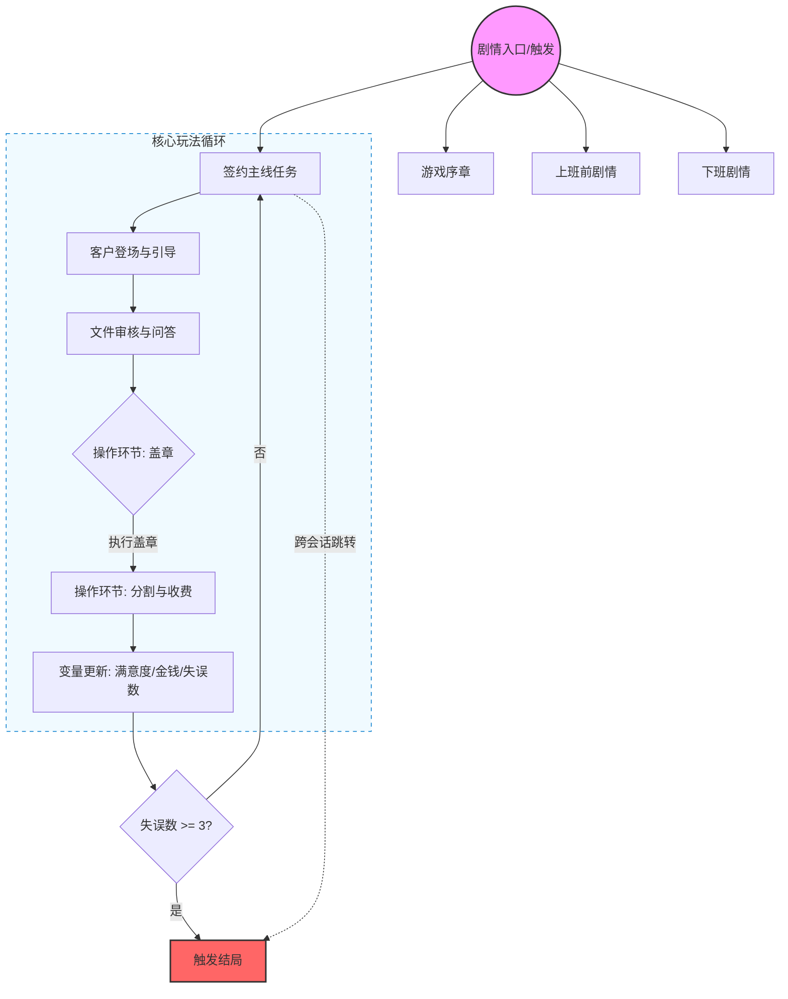

# ITC对话Json.json -> .yarn 转换报告

## 概览
- 来源: `Assets/Doc/ITC对话Json.json`
- 产物: `Assets/Doc/ITC对话Json_converted.yarn`
- 格式检查: 通过 `itc-yarn-authoring` 检查脚本（默认模式）
- 转换统计: 778 节点；12 个选项入口（menu sources）；41 个响应节点；8 处条件分支；20 处需要外部路由选择的分支

## 重点问题结论
### 1) 是否有 .yarn 无法处理的剧情对话逻辑？
有，主要是“操作环节/交互判定”类分支，原数据中以“多出边 + 无条件/无菜单”表示，或仅在 Description 里写了判定条件（但未写入 conditionsString）。这类逻辑 Yarn 无法单独判定，需要外部系统在进入节点前写入路由变量或判定变量。
- 已在转换稿中为这类节点加入 `route` 变量占位（如 `$route_C2_D146`、`$route_C3_D176` 等），并用注释标明每条分支含义。
- 典型例子:
  - `C2_D146`（选取印章正确/错误）
  - `C2_D155`（判定区域错误次数/动画流程）
  - `C3_D176`/`C3_D247`/`C3_D328`/`C3_D538`（“收取部分”比例阈值）
  - `C3_D252`/`C3_D449`/`C3_D586`（满意度阈值）

### 2) 玩家命名、变量定义信息整理在何处？是否散落在文案中？
- 玩家命名: Actor 列表中 `Player` 的 `Display Name` 为 **Barks**，我已将玩家发言显示名统一为 `Barks`。
- 变量定义: 全部集中在 JSON 的 `variables` 列表中（如 `DAY`、`satisfaction`、`Sign mistake` 等）。
- 文案中未直接散落变量定义，仅在逻辑语句中引用（转换后表现为 `<<set $...>>` / `<<if $...>>`）。
- 注意: 变量在脚本/条件中使用的是“下划线版本”（如 `Sign_mistake`、`Nmber_of_sign_mistake`），对应 JSON 里的含空格名称，未改变其逻辑语义。

### 3) 是否发现不可达节点？是文案设计不可达还是转换有误？
- 图结构上从每个 `START` 节点出发，**所有节点均可达**（未发现结构性不可达节点）。
- 运行时不可达风险主要来自条件分支与外部交互判定：
  - 条件控制分支会让某些节点在特定变量组合下不可达。
  - 20 个外部路由节点如果外部没有正确设置路由变量，可能导致部分路径无法触发。
这属于“剧情/玩法设计的条件约束”，而非转换错误。

### 4) 文案组织架构与分支走向（Mermaid）

## 说明与备注
- 使用默认模式（Text Animator 标签 `< >`，禁止 `[]`）。项目中的 `TA_YarnSpinner_Integration_Documentation.md` 未找到，因此未启用 converter 模式。
- 所有对白文本与选项文本已原样保留；仅新增必要的逻辑控制语句与路由注释。
