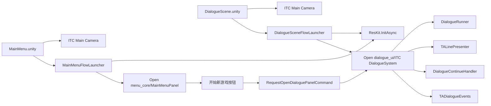
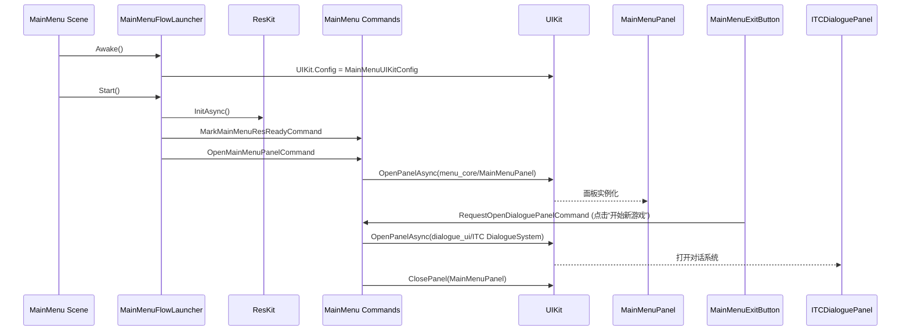
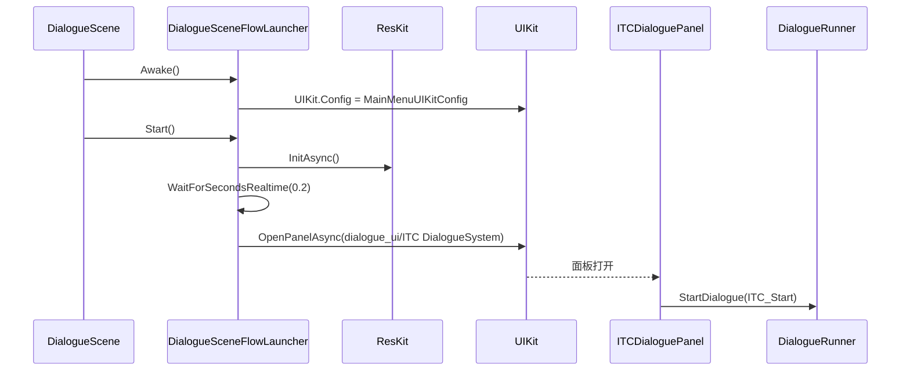
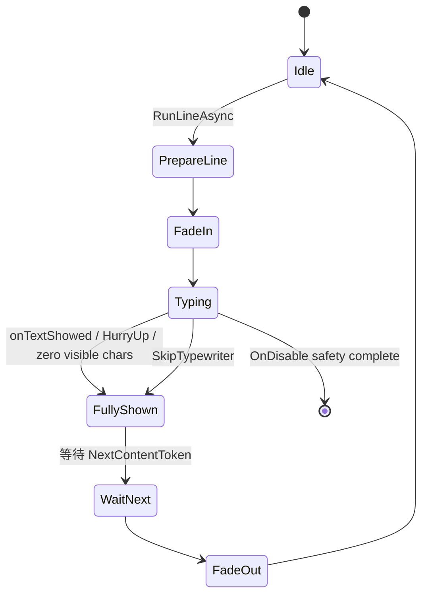
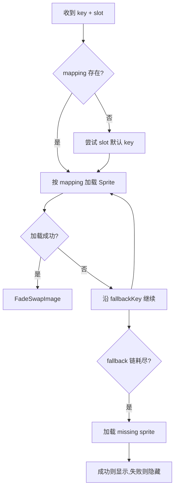
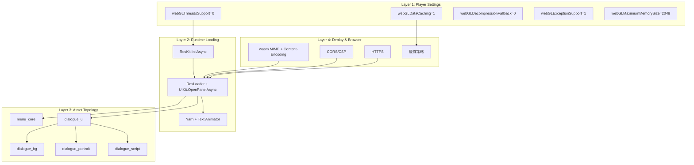
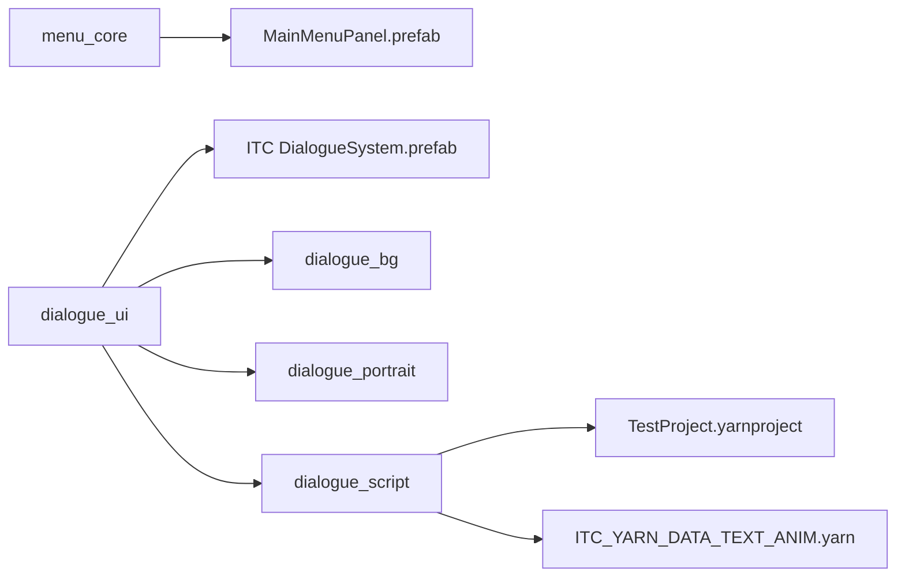
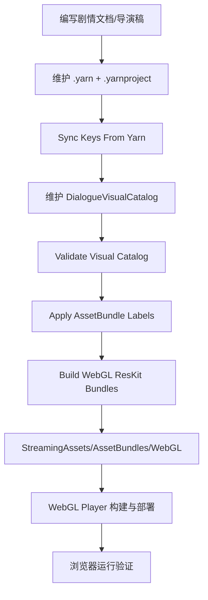
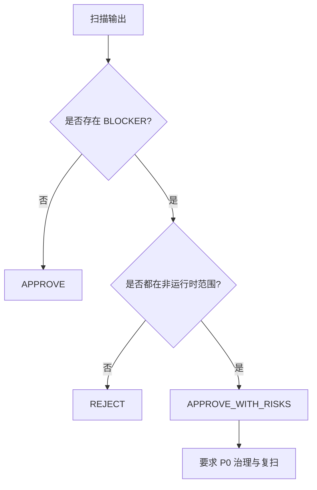

# ITC 核心场景与 WebGL 全景技术分析报告（导师汇报版）

版本：v2.0  
日期：2026-02-17  
代码快照：`develop@6d03b8b`  
Unity：`6000.3.0f1`

## 0. 这份报告怎么用（先给你心智模型）

你给导师讲的时候，可以用这 1 句话开场：

> 当前项目是“**双入口轻壳场景** + **统一对话运行时内核** + **ResKit 分包加载**”的 WebGL 架构，已经能支撑剧情持续生产，但在发布治理和 WebGL 规则收敛上还需要一轮 P0 加固。

然后按下面 4 层模型讲：

1. 场景层：`MainMenu` 与 `DialogueScene` 都是轻壳启动场景。
2. 业务层：最终都汇聚到 `ITC DialogueSystem`（Yarn + Text Animator + 输入/事件桥）。
3. 资源层：`menu_core / dialogue_ui / dialogue_bg / dialogue_portrait / dialogue_script` 分包。
4. WebGL 层：异步初始化已对齐，发布设置与部署规范还需收口。

---

## 1. 报告范围与证据源

本报告基于当前仓库实证，不是抽象推测。关键证据来自：

1. 场景：`Assets/Scenes/MainMenu.unity:133`、`Assets/Scenes/DialogueScene.unity:190`
2. 启动脚本：`Assets/Scripts/MainMenu/MainMenuFlowLauncher.cs:20`、`Assets/Scripts/Dialogue/DialogueSceneFlowLauncher.cs:24`
3. 命令与状态：`Assets/Scripts/MainMenu/MainMenuCommands.cs:13`、`Assets/Scripts/MainMenu/MainMenuStateModel.cs:5`
4. 对话核心：`Assets/Scripts/Dialogue/ITCDialoguePanel.cs:18`、`Assets/Scripts/Dialogue/TALinePresenter.cs:116`
5. Prefab 绑定：`Assets/Prefabs/UI/ITC DialogueSystem.prefab:1458`
6. Yarn 数据：`Assets/Doc/ITC Doc/dialogue/ITC_YARN_DATA_TEXT_ANIM.yarn:1`
7. Bundle 构建工具：`Assets/Editor/ITCDialogueResKitBuildTools.cs:35`
8. WebGL 设置：`ProjectSettings/ProjectSettings.asset:562`
9. Build 场景清单：`ProjectSettings/EditorBuildSettings.asset:7`
10. WebGL 扫描结果：`Temp/unity-webgl-check.md`

---

## 2. 高层结论（结论先行）

### 2.1 已搭建完成的“核心能力”

1. 形成了双入口核心场景：`MainMenu` 和 `DialogueScene`，两者都能启动同一套对话系统。
2. 主链路已采用 WebGL 友好策略：`ResKit.InitAsync()` + 分包加载 + StreamingAssets。
3. 对话系统链路完整：Yarn 节点驱动、立绘/背景切换、打字机、Skip/Continue、事件桥接。
4. 内容扩展条件具备：Yarn 节点规模、变量状态、视觉映射目录均已成体系。

### 2.2 当前最关键风险（按导师视角）

1. 发布清单风险：Build Settings 当前只有测试场景，核心场景未纳入正式构建白名单。  
证据：`ProjectSettings/EditorBuildSettings.asset:8`
2. WebGL 规则扫描“高噪声”风险：扫描结果 90 个 BLOCKER，主要来自 Editor/插件/框架范围，不等于业务运行时全阻断。  
证据：`Temp/unity-webgl-check.md`
3. 业务脚本仍有 WebGL 规则命中：`TALinePresenter` 命中 `UWG-THR-001`（3 处）。  
证据：`Assets/Scripts/Dialogue/TALinePresenter.cs:8`
4. Release 配置未最小化：`webGLExceptionSupport: 1`。  
证据：`ProjectSettings/ProjectSettings.asset:563`
5. 交互预期风险：主菜单“退出”在 WebGL 不会真正退出网页。  
证据：`Assets/Scripts/MainMenu/MainMenuExitButton.cs:76`

### 2.3 阶段判断

1. 内容研发阶段：`APPROVE_WITH_RISKS`（可以继续剧情和系统迭代）。
2. 面向 WebGL Release：需要先完成 P0 治理项再发布。

---

## 3. 核心场景架构建模

### 3.1 模型 M1：双入口轻壳场景 + 统一运行时内核



### 3.2 两个核心场景的“事实对照表”

| 项目 | MainMenu | DialogueScene | 结论 |
|---|---|---|---|
| Root 数量 | 2 | 2 | 都是轻壳场景 |
| Root 1 | `ITC Main Camera` | `ITC Main Camera` | 同一相机预制体复用 |
| Root 2 | `MainMenuFlowLauncher` | `DialogueSceneFlowLauncher` | 都由启动器驱动 |
| 是否切场景进入对话 | 否 | 否 | 都是 `UIKit.OpenPanelAsync<ITCDialoguePanel>` |
| 默认启动行为 | 打开主菜单面板 | 延迟 0.2s 直开对话面板 | 一个面向玩家，一个面向开发/调试 |

证据：`Assets/Scenes/MainMenu.unity:229`、`Assets/Scenes/DialogueScene.unity:228`、`Assets/Scripts/MainMenu/MainMenuCommands.cs:55`、`Assets/Scripts/Dialogue/DialogueSceneFlowLauncher.cs:47`

### 3.3 模型 M2：MainMenu 启动时序



关键参数：

1. `autoRunDialogueDemoFlow = 0`（默认关闭自动演示流）。证据：`Assets/Scenes/MainMenu.unity:151`
2. `waitPanelOpenTimeoutSeconds = 8`。证据：`Assets/Scenes/MainMenu.unity:153`

### 3.4 模型 M3：DialogueScene 直入时序



关键参数：

1. `autoOpenDialogueOnStart = 1`。证据：`Assets/Scenes/DialogueScene.unity:208`
2. `startupDelaySeconds = 0.2`。证据：`Assets/Scenes/DialogueScene.unity:209`

---

## 4. 对话系统内核深拆（业务链路讲清楚）

### 4.1 `ITC DialogueSystem` 预制体组成

核心组件（同一 prefab 内）：

1. `ITCDialoguePanel`：视觉命令注册、资源解析、切图和淡入淡出。
2. `DialogueRunner`：Yarn 节点运行。
3. `TALinePresenter`：Text Animator 行呈现。
4. `DialogueContinueHandler`：Space/Enter/鼠标继续与 Skip。
5. `TADialogueEvents`：打字机事件与 Skip 过滤桥。

证据：`Assets/Prefabs/UI/ITC DialogueSystem.prefab:1021`、`Assets/Prefabs/UI/ITC DialogueSystem.prefab:1373`、`Assets/Prefabs/UI/ITC DialogueSystem.prefab:1406`、`Assets/Prefabs/UI/ITC DialogueSystem.prefab:1460`

### 4.2 命令协议（Yarn -> 视觉）

`ITCDialoguePanel` 注册的 Yarn Command：

1. `itc_bg`
2. `itc_npc_main`
3. `itc_npc_avatar`
4. `itc_pc_avatar`
5. `itc_npc_main_hide`
6. `itc_npc_avatar_hide`
7. `itc_pc_avatar_hide`

证据：`Assets/Scripts/Dialogue/ITCDialoguePanel.cs:187`

### 4.3 视觉资源映射机制（Visual Catalog）

1. 运行时若未直接绑定 `visualCatalog`，会从 `Resources/Dialogue/DialogueVisualCatalog` 自动加载。  
证据：`Assets/Scripts/Dialogue/ITCDialoguePanel.cs:29`、`Assets/Scripts/Dialogue/ITCDialoguePanel.cs:135`
2. 映射表总计 39 条：背景 12、NpcMain 9、NpcAvatar 9、PcAvatar 9。
3. 提供 slot 默认 key 与 fallback 链；缺图走全局 missing sprite。

证据：`Assets/Resources/Dialogue/DialogueVisualCatalog.asset:24`

### 4.4 Yarn 数据规模（当前阶段）

统计（基于当前 `.yarn`）：

1. 节点数：40
2. `itc_bg` 命令：40
3. `itc_npc_main` 命令：21
4. `itc_npc_avatar` 命令：21
5. `hide` 命令：29
6. `jump`：72
7. `if`：25
8. `set`：75
9. `declare`：24

入口节点：`ITC_Start`。证据：`Assets/Doc/ITC Doc/dialogue/ITC_YARN_DATA_TEXT_ANIM.yarn:1`

### 4.5 模型 M4：文本行状态机（TALinePresenter）



重点：

1. 使用 `TaskCompletionSource` 做“文字显示完成”同步点。证据：`Assets/Scripts/Dialogue/TALinePresenter.cs:63`
2. 通过 `HurryUpToken` 实现 Skip 兜底，避免死等。证据：`Assets/Scripts/Dialogue/TALinePresenter.cs:194`
3. 通过 `lineTextCanvasGroup` 实现“只淡文本区”的行间过渡，减少闪烁。证据：`Assets/Scripts/Dialogue/TALinePresenter.cs:165`

### 4.6 模型 M5：视觉资源解析与 fallback 链



证据：`Assets/Scripts/Dialogue/ITCDialoguePanel.cs:314`

---

## 5. WebGL 全景模型（设计、处理、优化）

### 5.1 模型 M6：WebGL 四层架构图



### 5.2 WebGL 关键设置快照（当前项目）

| 设置 | 当前值 | 影响解读 |
|---|---|---|
| `webGLThreadsSupport` | 0 | 默认不走线程隔离部署，降低 COOP/COEP 复杂度 |
| `webGLDataCaching` | 1 | 二次访问性能更友好 |
| `webGLDecompressionFallback` | 0 | 要求部署侧正确处理压缩头与 MIME |
| `webGLExceptionSupport` | 1 | 非最小异常策略，Release 仍有优化空间 |
| `webGLMaximumMemorySize` | 2048 | 达到策略上限，需关注低内存设备体验 |
| `webGLMemoryGrowthMode` | 2 | 允许增长，需结合首包体量控制峰值 |
| `defaultScreenWidthWeb` | 960 |
| `defaultScreenHeightWeb` | 600 | Web 初始窗口尺寸偏开发默认，后续可按产品目标调整 |
| `runInBackground` | 0 | 页面失焦暂停，有利于省资源但影响后台行为 |
| `activeInputHandler` | 2 | 新旧输入并存，兼容期策略 |

证据：`ProjectSettings/ProjectSettings.asset:47`、`ProjectSettings/ProjectSettings.asset:563`、`ProjectSettings/ProjectSettings.asset:704`

### 5.3 资源分包结构与体量（WebGL 产物实测）

#### 模型 M7：Bundle 依赖图



证据：`Assets/StreamingAssets/AssetBundles/WebGL/dialogue_ui.manifest`、`Assets/StreamingAssets/AssetBundles/WebGL/dialogue_script.manifest`

#### 体量统计（不含 manifest/meta 文本）

| Bundle | Bytes | MiB | 占比 |
|---|---:|---:|---:|
| `dialogue_bg_*` | 56,089,355 | 53.49 | 78.25% |
| `dialogue_ui_*` | 14,137,481 | 13.48 | 19.72% |
| `menu_fx_*` | 635,080 | 0.61 | 0.89% |
| `dialogue_portrait_*` | 566,964 | 0.54 | 0.79% |
| `menu_core_*` | 191,537 | 0.18 | 0.27% |
| `unifiedraytracing_*` | 38,679 | 0.04 | 0.05% |
| `dialogue_script_*` | 17,976 | 0.02 | 0.03% |
| `asset_bundle_config.bin` | 3,775 | 0.00 | 0.01% |
| **总计** | **71,680,847** | **68.36** | **100%** |

核心结论：当前 WebGL 首要瓶颈不是脚本，而是**背景包体积**。

### 5.4 模型 M8：首屏到首句链路（性能视角）

```mermaid
flowchart LR
  A[进入场景] --> B[ResKit.InitAsync]
  B --> C[读取 asset_bundle_config.bin]
  C --> D[OpenPanelAsync]
  D --> E[加载 dialogue_ui]
  E --> F[按依赖拉取 dialogue_bg/dialogue_portrait/dialogue_script]
  F --> G[实例化 ITC DialogueSystem]
  G --> H[StartDialogue(ITC_Start)]
  H --> I[首句显示]
```

这条链路解释了为什么 `dialogue_bg` 会直接影响“首句可见时间”。

### 5.5 Build/部署流程模型（工程治理视角）



证据：`Assets/Editor/ITCDialogueVisualCatalogEditorWindow.cs:193`、`Assets/Editor/ITCDialogueResKitBuildTools.cs:35`

---

## 6. WebGL 自检结果（按 unity-webgl 规则矩阵）

### 6.1 Scope

本次执行：

1. 命令：`python .codex/skills/unity-webgl/scripts/webgl_self_check.py --repo-root . --json-out Temp/unity-webgl-check.json --md-out Temp/unity-webgl-check.md`
2. 扫描范围规则：默认包含 `Assets/**/*.cs`，排除 `Assets/Plugins/**`，但**不会排除** `Assets/**/Editor/**`。  
证据：`.codex/skills/unity-webgl/scripts/webgl_self_check.py:22`

### 6.2 Findings（分层解释）

#### BLOCKER

1. 总量：90（规则引擎严格口径）
2. 规则构成：`UWG-THR-001` 75 条，`UWG-NET-001` 15 条
3. 路径分布：
- `Assets/MCPForUnity`：48
- `Assets/QFramework`：25
- `Assets/Editor`：14
- `Assets/Scripts`：3

业务脚本命中的 3 条均在：`Assets/Scripts/Dialogue/TALinePresenter.cs`（`using System.Threading` 与 `TaskCompletionSource`）。

#### WARNING

1. `UWG-SET-004`：`webGLExceptionSupport` 非最小值。  
证据：`ProjectSettings/ProjectSettings.asset:563`

### 6.3 决策（按规则与业务双视角）

#### 严格规则矩阵结论

`REJECT`（存在未闭环 BLOCKER）。

#### 业务运行时视角结论

`APPROVE_WITH_RISKS`（可继续研发，但发布前必须治理）。

理由：绝大多数 BLOCKER 属于 Editor/工具链/第三方框架扫描命中，和当前 WebGL 业务主链不完全等价。

### 6.4 模型 M9：决策分流图



---

## 7. 项目流程“讲清楚版”（你汇报时可直接用）

### 7.1 一句话流程

内容团队写 Yarn -> 美术映射到 Visual Catalog -> 编辑器工具做校验/打包 -> 场景启动异步初始化 -> 打开对话系统面板 -> Yarn 驱动视觉与文本表现 -> 输入系统控制继续与 Skip。

### 7.2 模型 M10：导师讲解主流程（业务 + 技术合并）


---

## 8. 优化路线图（用于技术讨论和规划）

## 8.1 P0（发布前必须）

1. 修正 Build Settings 场景清单，纳入 `MainMenu` 与 `DialogueScene`。  
证据：`ProjectSettings/EditorBuildSettings.asset:8`
2. 定义 WebGL 退出行为替代 `Application.Quit()`（如返回主菜单、弹窗提示、跳转页）。  
证据：`Assets/Scripts/MainMenu/MainMenuExitButton.cs:76`
3. 将 WebGL 自检分成“运行时白名单扫描”与“全仓扫描”双模式，降低噪声误报。
4. 对 `TALinePresenter` 的 `TaskCompletionSource` 路径给出明确 WebGL 合规说明或替代实现。
5. 将 `webGLExceptionSupport` 切换成 Release 最小策略并建立 Debug/Release 配置分档。

## 8.2 P1（近期收益最大）

1. 对 `dialogue_bg` 做二次拆包（按章节/日程/场景组），降低首屏下载体积。
2. 增加首句可见时间指标：`进入场景 -> 首句渲染`。
3. 清理非关键 bundle（例如 `menu_fx` 是否必要）并做构建产物审计。
4. 输出部署规范文档：`wasm` MIME、压缩头、CORS、CSP、HTTPS。

## 8.3 P2（中期架构演进）

1. 让 `DialogueScene` 脱离 `MainMenuApp` 的架构耦合，形成独立域 Architecture。
2. 将关键运营参数（打字机速度、fade、autoAdvance）配置化。
3. 增加自动化冒烟：场景打开、对话首节点、关键命令映射、WebGL 构建后静态检查。

---

## 9. 导师汇报模板（你可直接复述）

### 9.1 30 秒版

当前项目已经完成双入口核心场景，所有业务都汇聚到统一对话运行时；WebGL 异步初始化和分包加载主链已跑通，主要风险在发布治理与包体优化，特别是背景资源占总包体约 78%。

### 9.2 3 分钟版

1. 架构上我们不是“重场景切换”，而是“轻壳场景 + 面板驱动”。
2. 内容上 Yarn 节点、变量、命令映射已经形成可扩展骨架。
3. WebGL 上线程支持已关闭、缓存已开启、资源异步已对齐；但是异常策略和扫描规则还需收敛。
4. 接下来 P0 先做发布白名单、退出行为、合规扫描治理；P1 再做背景包拆分与首句耗时优化。

---

## 10. 关键证据索引（可审计）

1. 场景 Root：`Assets/Scenes/MainMenu.unity:229`、`Assets/Scenes/DialogueScene.unity:228`
2. MainMenu 启动配置：`Assets/Scenes/MainMenu.unity:151`
3. DialogueScene 启动配置：`Assets/Scenes/DialogueScene.unity:208`
4. MainMenu 启动逻辑：`Assets/Scripts/MainMenu/MainMenuFlowLauncher.cs:29`
5. MainMenu -> 对话命令：`Assets/Scripts/MainMenu/MainMenuCommands.cs:55`
6. DialogueScene 直开对话：`Assets/Scripts/Dialogue/DialogueSceneFlowLauncher.cs:47`
7. 主菜单按钮行为：`Assets/Scripts/MainMenu/MainMenuExitButton.cs:52`
8. 对话命令注册：`Assets/Scripts/Dialogue/ITCDialoguePanel.cs:187`
9. 视觉 fallback 链：`Assets/Scripts/Dialogue/ITCDialoguePanel.cs:314`
10. 文本状态机核心：`Assets/Scripts/Dialogue/TALinePresenter.cs:116`
11. Yarn 入口节点：`Assets/Doc/ITC Doc/dialogue/ITC_YARN_DATA_TEXT_ANIM.yarn:1`
12. YarnProject 基础语言：`Assets/Doc/ITC Doc/dialogue/TestProject.yarnproject:11`
13. VisualCatalog 默认配置：`Assets/Resources/Dialogue/DialogueVisualCatalog.asset:15`
14. Bundle 构建菜单：`Assets/Editor/ITCDialogueResKitBuildTools.cs:35`
15. Bundle 构建压缩/Hash：`Assets/QFramework/Toolkits/ResKit/Editor/BuildScript.cs:50`
16. Build Settings 现状：`ProjectSettings/EditorBuildSettings.asset:8`
17. WebGL 设置：`ProjectSettings/ProjectSettings.asset:562`
18. WebGL 质量档位映射：`ProjectSettings/QualitySettings.asset:332`
19. WebGL 扫描输出：`Temp/unity-webgl-check.md`
20. 扫描规则包含范围：`.codex/skills/unity-webgl/scripts/webgl_self_check.py:22`

---

## 11. 当前阶段最终判断

1. 架构可扩展性：达标。
2. WebGL 主链可运行性：达标。
3. Release 就绪度：未达标（需先完成 P0）。

建议将下一轮里程碑定义为：**“WebGL 发布治理闭环 + 首屏体量优化”**，再进入更大规模内容扩展。
