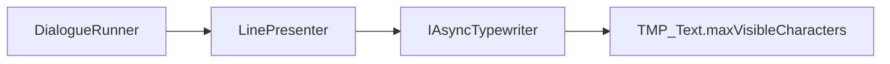
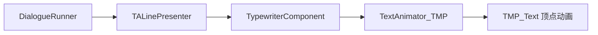

# Text Animator + Yarn Spinner 整合改造报告

> **日期**: 2026-01-14
> **状态**: ✅ 实现完成

---

## 1. 改造概述

### 1.1 改造目标
以 Text Animator 为主导，替换 Yarn Spinner 默认的文字呈现系统，获得：
- 丰富的文字动画效果
- 更强大的打字机控制
- 内置事件/动作系统

### 1.2 改造成果

```
Assets/Scripts/Dialogue/
├── TALinePresenter.cs        ← 核心：替代 LinePresenter
├── YarnMarkupConverter.cs    ← 标记转换器（可选）
├── DialogueContinueHandler.cs ← 输入处理
└── TADialogueEvents.cs       ← 事件桥接
```

---

## 2. 架构对比

### 2.1 改造前（Yarn Spinner 原生）



### 2.2 改造后（Text Animator 主导）



---

## 3. 核心组件说明

### 3.1 TALinePresenter

| 功能 | 实现 |
|------|------|
| 继承 | [DialoguePresenterBase](file:///C:/Users/jinji/Documents/GitHub/ITC-Unity6/Library/PackageCache/dev.yarnspinner.unity@040b0f4542b5/Runtime/Views/DialoguePresenterBase.cs#40-177) |
| 文本显示 | 调用 `typewriter.ShowText()` |
| 跳过/加速 | 响应 [LineCancellationToken](file:///C:/Users/jinji/Documents/GitHub/ITC-Unity6/Library/PackageCache/dev.yarnspinner.unity@040b0f4542b5/Runtime/DialogueRunner/DialogueRunner.cs#29-89) |
| 淡入淡出 | 独立实现 [FadeAlphaAsync](file:///C:/Users/jinji/Documents/GitHub/ITC-Unity6/Library/PackageCache/dev.yarnspinner.unity@040b0f4542b5/Runtime/Views/Effects.cs#29-49) |

**关键代码片段**：
```csharp
public override async YarnTask RunLineAsync(LocalizedLine line, LineCancellationToken token)
{
    typewriter.ShowText(displayText);
    
    using var hurryUpReg = token.HurryUpToken.Register(() => typewriter.SkipTypewriter());
    
    await textShowCompletionSource.Task;
    await YarnTask.WaitUntilCanceled(token.NextContentToken);
}
```

### 3.2 事件流

```
TypewriterComponent
  ├─ onCharacterVisible → 打字音效
  ├─ onTextShowed → 行显示完成
  └─ onMessage → 自定义事件 (<?event>)
              ↓
     TADialogueEvents
              ↓
     游戏逻辑（音效、镜头等）
```

---

## 4. 使用方式

### 4.1 场景配置
1. 移除默认 [LinePresenter](file:///C:/Users/jinji/Documents/GitHub/ITC-Unity6/Library/PackageCache/dev.yarnspinner.unity@040b0f4542b5/Runtime/Views/LinePresenter.cs#26-422)
2. 添加 [TALinePresenter](file:///C:/Users/jinji/Documents/GitHub/ITC-Unity6/Assets/Scripts/Dialogue/TALinePresenter.cs#21-253) 到对话 Canvas
3. 配置 `TextAnimator_TMP` + [TypewriterComponent](file:///C:/Users/jinji/Documents/GitHub/ITC-Unity6/Assets/Plugins/Febucci/Text%20Animator%20for%20Unity/Scripts/Runtime/Components/Typewriter/_Core/TypewriterComponent.cs#30-469)
4. 在 `DialogueRunner.dialoguePresenters` 中添加 [TALinePresenter](file:///C:/Users/jinji/Documents/GitHub/ITC-Unity6/Assets/Scripts/Dialogue/TALinePresenter.cs#21-253)

### 4.2 Yarn 脚本示例

```yarn
title: Demo
---
角色: 我<shake>害怕</shake>极了...<waitfor=1>
角色: {fade}这是淡入效果{/fade}
角色: <wave><rainbow>组合效果！</rainbow></wave>
角色: <?playSound=ding>听到了吗？
===
```

---

## 5. 测试验证方案

### 5.1 最小验证步骤

1. **创建测试场景**
   ```
   - 新建场景
   - 创建 Canvas + DialogueRunner
   - 创建对话文本 TMP
   - 添加 TALinePresenter + TextAnimator_TMP + TypewriterComponent
   ```

2. **创建测试 Yarn 脚本**
   ```yarn
   title: Test
   ---
   Test: 普通文字显示测试
   Test: <shake>抖动效果测试</shake>
   Test: <wave>波浪效果测试</wave>
   Test: 暂停测试<waitfor=2>继续
   Test: {fade}淡入效果测试{/fade}
   Test: 测试完成！
   ===
   ```

3. **验证清单**

   | 测试项 | 预期结果 | 通过 |
   |--------|----------|------|
   | 文字逐字显示 | 字符按顺序出现 | ☐ |
   | `<shake>` 效果 | 文字抖动 | ☐ |
   | `<wave>` 效果 | 文字波浪起伏 | ☐ |
   | `<waitfor>` 暂停 | 停顿2秒后继续 | ☐ |
   | `{fade}` 入场 | 文字淡入 | ☐ |
   | 点击跳过 | 立即显示全部 | ☐ |
   | 点击继续 | 进入下一行 | ☐ |

4. **控制台检查**
   - 无报错
   - 无警告（除 Yarn 编译警告）

---

## 6. 已知限制

| 限制 | 说明 | 解决方案 |
|------|------|----------|
| Yarn `[pause]` 不识别 | TA 使用 `<waitfor>` | 直接使用 TA 语法 |
| MarkupPalette 不兼容 | TA 有自己的 Styles | 使用 TA Styles |
| 选项不由此组件处理 | TALinePresenter 只处理台词 | 保留 OptionsPresenter |

---

## 7. 文件清单

| 文件 | 路径 |
|------|------|
| 核心 Presenter | [TALinePresenter.cs](file:///C:/Users/jinji/Documents/GitHub/ITC-Unity6/Assets/Scripts/Dialogue/TALinePresenter.cs) |
| 标记转换器 | [YarnMarkupConverter.cs](file:///C:/Users/jinji/Documents/GitHub/ITC-Unity6/Assets/Scripts/Dialogue/YarnMarkupConverter.cs) |
| 输入处理 | [DialogueContinueHandler.cs](file:///C:/Users/jinji/Documents/GitHub/ITC-Unity6/Assets/Scripts/Dialogue/DialogueContinueHandler.cs) |
| 事件桥接 | [TADialogueEvents.cs](file:///C:/Users/jinji/Documents/GitHub/ITC-Unity6/Assets/Scripts/Dialogue/TADialogueEvents.cs) |
| 使用指南 | [TA_YarnSpinner_Usage_Guide.md](file:///C:/Users/jinji/.gemini/antigravity/brain/1caa991f-9e38-4c2d-b70e-525c09e41957/TA_YarnSpinner_Usage_Guide.md) |
